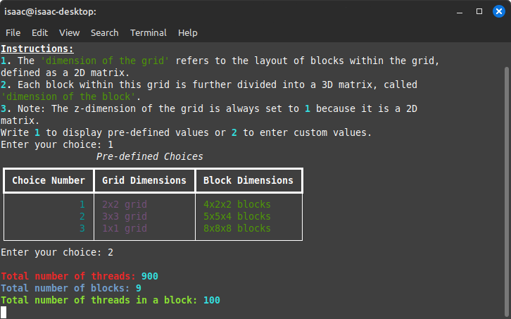

# 3D Visualization of CUDA Thread Blocks

This program offers a 3D visualization of CUDA thread blocks and grids using VTK and Rich console libraries. It provides a user-friendly interface for specifying the dimensions of the grid and blocks, then visualizes these configurations in a 3D space.

## Gallery




## Features

- **Dynamic Visualization**: View CUDA thread blocks and grid configurations in 3D.
- **Custom Configuration**: Users can specify custom dimensions for blocks and grids.
- **Interactive Console**: The program provides an interactive console interface for input and guidance.

## Prerequisites

Before running this program, ensure you have Python installed on your system.

## Installation

Ensure all dependencies are installed by running the `install.sh` script:

```bash
chmod +x install.sh
./install.sh
```

## Usage

To run the program, execute the `run.sh` script from the terminal:

```bash
./run.sh
```

Upon launching, the program will prompt you to choose between using predefined dimensions for the grid and blocks or entering custom dimensions. After selecting an option and providing the necessary inputs, the program will render the 3D visualization.

### How It Works

1. **Start the Program**: Run the script using the command above.
2. **Input Configuration**: Choose to use either predefined or custom dimensions for blocks and grids.
3. **Visualization**: After entering your configurations, the program renders a 3D visualization where blocks are represented as colored cubes arranged in a grid.
